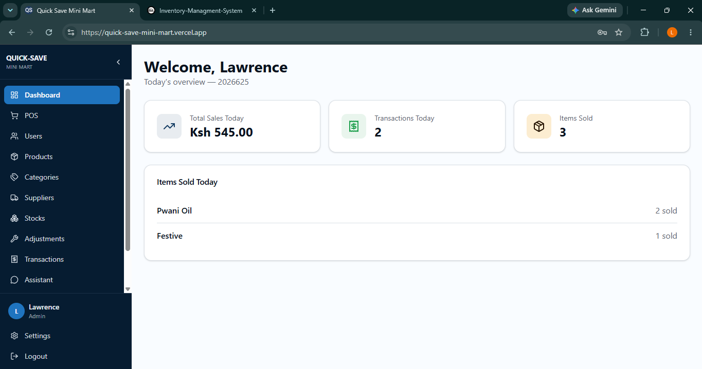
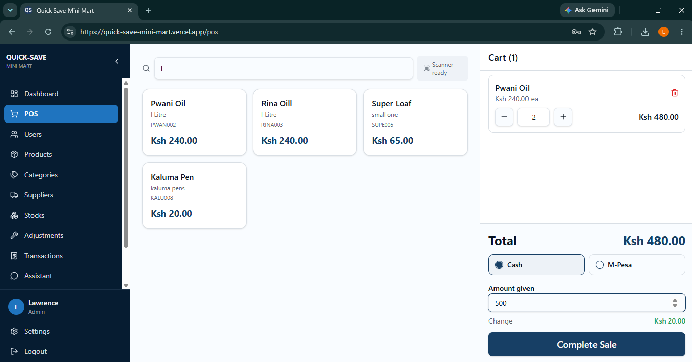
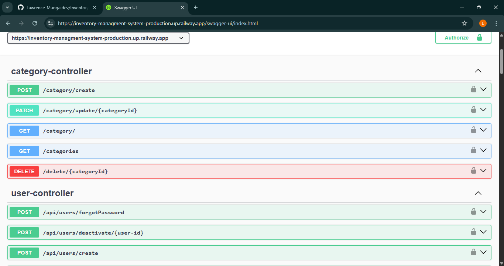

## # INVENTORY MANAGEMENT SYSTEM
 
A backend REST API system built on Spring Boot to help small retail owners manage products and track stock in real time. The system has two roles, **ADMIN** and **CASHIER**, with clearly defined permissions, automated notifications, and a full sales/payment workflow including M-Pesa.
 
## Live Demo: https://quick-save-mini-mart.vercel.app/login





 
Swagger UI: https://quick-save-mini-mart.up.railway.app/swagger-ui/index.html



 
 
## ROLES
 
### ADMIN
 
- Creates and manages Cashiers, Products, Categories, Suppliers and Stocks
- Approves or rejects Restock Requests from Cashiers
- Approves or rejects Stock Adjustment Requests (theft, damage, etc.)
- Receives low stock notifications, expiry alerts, and daily/monthly sales reports
### CASHIER
 
- Sells products via Cash or M-Pesa STK Push
- Scans products using a barcode scanner during checkout
- Prints thermal receipts after a sale
- Submits Restock Requests which require Admin approval
- Submits Stock Adjustment Requests for losses like theft or damage which require Admin approval
## Features
 
- **JWT Authentication** – Secure role-based access with token blacklisting on logout
- **Stock Management** – Full stock flow tracking with approvals, tracked per batch
- **Stock Adjustments** – Track theft, damage and other losses
- **Expiry Tracking** – Per-batch expiry monitoring with automated 8AM (Nairobi time) notifications
- **Low Stock Notification** – Automatically notifies the admin for low stock
- **M-Pesa STK Push** – Integrated M-Pesa for mobile payments, with callback handling
- **Barcode Scanning** – Product lookup at checkout via barcode scanner (Syble XB-8602)
- **Thermal Receipt Printing** – Print physical receipts after each transaction
- **Redis Caching** – JWT blacklist, login rate limiting, M-Pesa STK Push rate limiting, and barcode/product lookup caching (lookup cache deliberately excludes live stock counts to avoid frequent invalidation)
- **Rate Limiting** – Bucket4j-based limits on login and STK Push endpoints to prevent abuse
- **AI Chatbot** – In-app assistant for quick queries, proxied through Spring Boot to an n8n webhook
- **Daily Email Report** – Automatically sends a daily summary of sales
- **Monthly Report** – Profit, loss and monthly sales
- **Daily Report** – A daily breakdown of sales
- **Swagger Documentation** – Full interactive API documentation
## TECH STACK
 
| Technology | Purpose |
|------------|---------|
| Java 21 | Programming language |
| Spring Boot | Backend framework |
| MySQL | Primary database |
| Redis | Caching, rate limiting, JWT blacklist |
| Spring Security & JWT | Authentication and authorization |
| M-Pesa STK Push | Mobile payments |
| Resend | Email notifications |
| n8n | Chatbot webhook backend |
| Swagger | API documentation |
| React, Vite, TypeScript | Frontend (deployed separately) |
| Docker & Docker Compose | Containerized local development (multi-stage build, MySQL + Redis + app) |
| Railway | Backend + MySQL + Redis deployment |
| Vercel | Frontend deployment |
 
## ARCHITECTURE
 
### System Entities
 
| Entity | Description |
|--------|-------------|
| User | Admin and Cashier accounts |
| Category | Product categories |
| Product | Individual products |
| Notification | System notifications |
| Supplier | Product suppliers |
| Stock | Stock record per product, tracked per batch with expiry |
| Stock Adjustments | Theft, damage, and other loss records |
| Transaction | Sales records |
| TransactionItem | Individual items in a transaction |
| Mpesa | Payment records |
 
### Relationships
 
1. One Category can have Many Products
2. One User can create Many Notifications
3. One User can create many Transactions
4. One Transaction can have many TransactionItem
5. One Supplier can bring Many Products
6. One User can create many StockAdjustments
7. One Product can be in Many TransactionItem
8. One Product can be in Stock Many times
## API Endpoints
 
### Auth
 
| Method | Endpoint | Access |
|--------|----------|--------|
| POST | /api/auth/register | Admin Only |
| POST | /api/auth/logIn | Everyone |
 
### Notification
 
| Method | Endpoint | Access |
|--------|----------|--------|
| POST | /api/notifications/markasread/{notificationId} | Authenticated User |
| GET | /api/notifications | Authenticated User |
| GET | /api/notifications/{notificationId} | Authenticated User |
 
### Stock
 
| Method | Endpoint | Access |
|--------|----------|--------|
| POST | /api/stocks/create | Everyone |
| PATCH | /api/stocks/approve/{stockId} | Admin Only |
| PATCH | /api/stocks/reject/{stockId} | Admin Only |
| GET | /api/stocks | Admin Only |
 
### Report
 
| Method | Endpoint | Access |
|--------|----------|--------|
| GET | /api/report/today | Everyone |
| GET | /api/report/thismonth | Admin |
| GET | /api/report/daterange | Admin |
 
### Transactions
 
| Method | Endpoint | Access |
|--------|----------|--------|
| POST | /api/Transactions/create (supports both Cash and Mpesa STK push) | Everyone |
| GET | /api/Transactions | Admin Only |
| GET | /api/Transactions/{transactionId} | Admin Only |
| GET | /api/Transactions/today | Admin Only |
| GET | /api/Transactions/range | Admin Only |
 
### Mpesa
 
| Method | Endpoint | Access |
|--------|----------|--------|
| POST | /api/mpesa/callback | Server Only |
 
### Stock Adjustments
 
| Method | Endpoint | Access |
|--------|----------|--------|
| POST | /api/stockAdjustments/adjustrequest | Cashier |
| PATCH | /api/stockAdjustments/approve/{adjustmentId} | Admin Only |
| PATCH | /api/stockAdjustments/reject/{adjustmentId} | Admin Only |
| GET | /api/stockAdjustments | Admin Only |
 
### Chatbot
 
| Method | Endpoint | Access |
|--------|----------|--------|
| POST | /api/chatbot/ask | Authenticated User |
 
## Setup & Installation
 
### Option A — Run with Docker (recommended)
 
The project ships with a multi-stage `Dockerfile` and a `docker-compose.yml` that spins up the app, MySQL, and Redis together, with persistent volumes for data.
 
#### Requirements
 
- Docker
- Docker Compose
#### Steps
 
1. Clone the repository
```
   git clone https://github.com/Lawrence-Mungaidev/Inventory-Managment-System
```
2. Configure environment variables — create a `.env` file in the project root with the variables below
3. Build and start all services
```
   docker compose up --build
```
4. Access Swagger UI
```
   http://localhost:8080/swagger-ui/index.html
```
 
Data for MySQL and Redis persists across container restarts via Docker volumes. To stop the stack without losing data:
```
docker compose down
```
To stop and wipe all persisted data:
```
docker compose down -v
```
 
### Option B — Run locally with Maven
 
#### Requirements
 
- Java 21
- Maven
- MySQL
- Redis
#### Steps
 
1. Clone the repository
```
   git clone https://github.com/Lawrence-Mungaidev/Inventory-Managment-System
```
2. Configure environment variables — create an `application.yaml` or set the variables below
3. Run the application
```
   mvn spring-boot:run
```
4. Access Swagger UI
```
   http://localhost:8080/swagger-ui/index.html
```
 
## Environment Variables
 
### Database
 
| Variable | Description |
|----------|-------------|
| SPRING_DATASOURCE_URL | Database URL |
| SPRING_DATASOURCE_USERNAME | Database username |
| SPRING_DATASOURCE_PASSWORD | Database password |
 
### Redis
 
| Variable | Description |
|----------|-------------|
| SPRING_REDIS_HOST | Redis host |
| SPRING_REDIS_PORT | Redis port |
| SPRING_REDIS_PASSWORD | Redis password |
 
### JWT
 
| Variable | Description |
|----------|-------------|
| JWT_SECRET | Secret key (Base64-encoded) |
| JWT_EXPIRATION | Expiration time in milliseconds |
 
### Mail
 
| Variable | Description |
|----------|-------------|
| RESEND_API_KEY | API key for sending email notifications via Resend |
| MAIL_FROM_ADDRESS | Verified sender address |
 
### Mpesa
 
| Variable | Description |
|----------|-------------|
| MPESA_CONSUMER_KEY | Daraja consumer key |
| MPESA_CONSUMER_SECRET | Daraja consumer secret |
| MPESA_CALLBACK_URL | Callback URL for STK push response |
 
### Chatbot
 
| Variable | Description |
|----------|-------------|
| N8N_WEBHOOK_URL | Webhook URL for the chatbot proxy |
 
## Deployment
 
The application is deployed on Railway with:
 
- Spring Boot service (built natively by Railway, not from the Dockerfile)
- MySQL service (Railway managed database)
- Redis service (Railway managed)
- Environment variables configured at service level
The Dockerfile and `docker-compose.yml` are used for local containerized development only (app + MySQL + Redis with persistent volumes) — see [Setup & Installation](#setup--installation).
 
The frontend (React, Vite, TypeScript) is deployed separately on Vercel.
 
## Author
 
Lawrence Mungai
 
Backend Developer | Spring Boot | Java Developer
 
LinkedIn: https://www.linkedin.com/in/lawrence-mungai-266a9130b
 
GitHub: https://github.com/Lawrence-Mungaidev